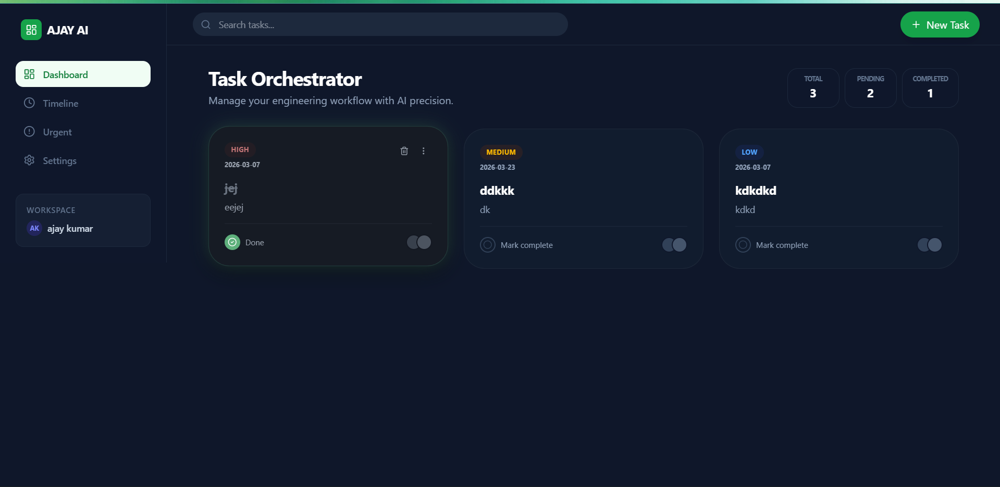
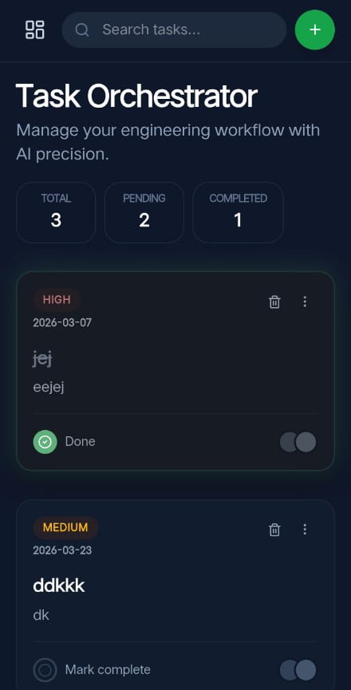

# 🚀 Task Orchestrator – Smart Task Management Web App

Task Orchestrator is a modern and responsive task management web application that helps users organize, track, and manage their daily tasks efficiently. The application provides a clean interface, smooth animations, and a simple workflow for productivity.

---

## 📌 Features

* ✅ Create new tasks quickly
* 📝 Manage and organize tasks easily
* ✔️ Mark tasks as completed or pending
* 🗑️ Delete tasks
* ⚡ Task priority system (Normal / Urgent)
* 📅 Timeline view of tasks
* 📱 Fully responsive (Desktop + Mobile)
* 🎨 Clean modern UI
* ✨ Smooth animations and interactions

---

## 🛠 Tech Stack

**Frontend**

* React
* TypeScript

**UI & Styling**

* Tailwind CSS
* Lucide React Icons
* Framer Motion (Animations)

**Deployment**

* Vercel

---

## 📂 Project Structure

```
src
│
├── components
│   ├── TaskCard.tsx
│   ├── TaskList.tsx
│   └── Navbar.tsx
│
├── types
│   └── task.ts
│
├── utils
│   └── helpers.ts
│
├── App.tsx
└── main.tsx
```

---

## ⚙️ Installation & Setup

Clone the repository

```
git clone https://github.com/your-username/task-orchestrator.git
```

Go to the project directory

```
cd task-orchestrator
```

Install dependencies

```
npm install
```

Run the development server

```
npm run dev
```

Now open in browser

```
http://localhost:5173
```

---

## 📸 Screenshots

### Dashboard


<p align="center">
  
  
</p>

---

## 🌐 Live Demo

```
https://your-project-name.vercel.app
```

---

## 📈 Future Improvements

* User authentication
* Cloud database integration
* Drag & drop tasks
* Task reminders
* Notification system

---

## 👨‍💻 Author

**Ajay Kumar**
full stack devleper

---

## ⭐ Support

If you like this project, consider giving it a ⭐ on GitHub!
